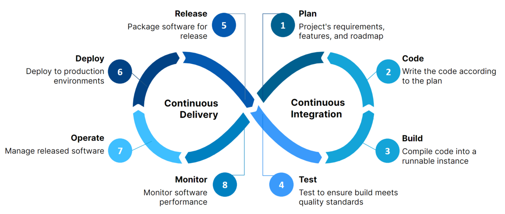
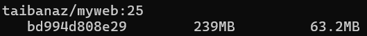
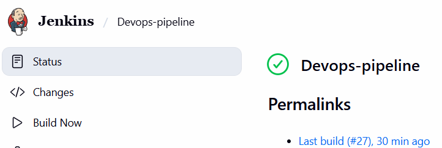
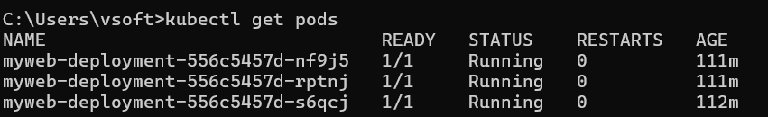
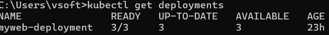
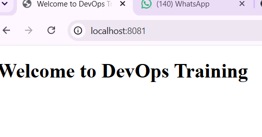

# AWS Infrastructure & CI/CD Pipeline Project

## Project Overview

This project demonstrates a complete DevOps CI/CD pipeline.

The application source code is stored in GitHub. Jenkins automatically pulls the latest code, builds a Docker image, pushes the image to Docker Hub, and deploys the application to Kubernetes using deployment and service manifests.

---

# Architecture

The following diagram shows the complete CI/CD workflow of this project.

Developer
↓
GitHub
↓
Jenkins
↓
Docker Build
↓
Docker Hub
↓
Kubernetes Deployment
↓
Kubernetes Service
↓
Users

---

# Technologies Used

- AWS EC2
- Jenkins
- Git & GitHub
- Docker
- Docker Hub
- Kubernetes (Kind)
- Nginx

---

# Project Workflow

1. Developer pushes code to GitHub.
2. Jenkins pulls the latest code.
3. Jenkins builds the Docker image.
4. Jenkins logs into Docker Hub.
5. Docker image is pushed to Docker Hub.
6. Kubernetes deploys the latest image.
7. Service exposes the application.
8. Users access the deployed application.

---

# Project Files

- Dockerfile
- Jenkinsfile
- deployment.yaml
- service.yaml
- README.md

---

# Screenshots

## Docker Images

Shows the Docker image created for this project.

---

## Jenkins Pipeline Success

Shows the successful Jenkins pipeline execution.

---

## Kubernetes Pods

Shows all running Kubernetes Pods.

---

## Kubernetes Deployment

Shows the deployment created in Kubernetes.

---

## Kubernetes Service

Shows the Kubernetes service exposing the application.

---

## Application Output

Shows the application running successfully.

---

# Components Explanation

## GitHub

Stores the application source code.

## Jenkins

Automates the CI/CD pipeline.

## Docker

Packages the application into a container image.

## Docker Hub

Stores Docker images.

## Kubernetes

Deploys and manages containerized applications.

## Deployment

Maintains the desired number of Pods.

## Service

Exposes the application for users.

---

# Commands Used

### Docker Build

bash
docker build -t taibanaz/myweb:25 .

### Docker Push

bash
docker push taibanaz/myweb:25

### Kubernetes Deployment

bash
kubectl apply -f deployment.yaml

### Kubernetes Service

bash
kubectl apply -f service.yaml

### Verify Pods

bash
kubectl get pods

### Verify Deployment

bash
kubectl get deployments

### Verify Service

bash
kubectl get svc
---

# Author

Taibanaz Khan